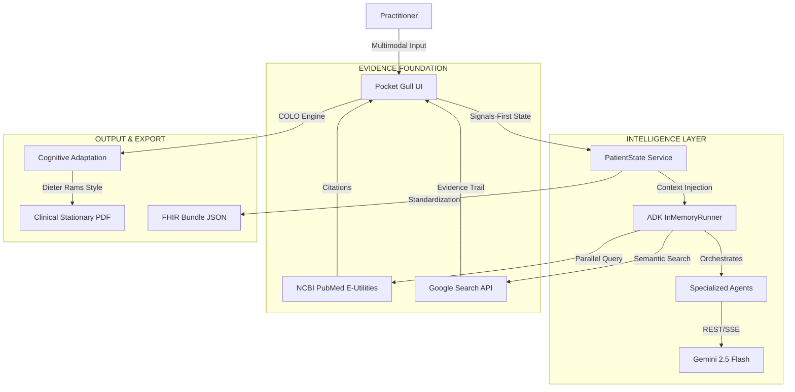

# 🕊️ POCKET GULL
**Aerial Perspective for the Clinical Ocean**

---

### PREPARED FOR
**Google Gemini Live Agent Challenge** / Hackathon 2026

### CATEGORY
**Live Agents 🗣️** (Multimodal Synthesis & Agent Orchestration)

### VISION
*"To provide practitioners with the 'Gull's Eye View'—the ability to rise above the turbulent sea of medical data and see the clear, actionable patterns beneath."*

---

## 📋 THE STORY OF THE SEAGULL

In modern medicine, practitioners are often drowning in a "Sea of Information"—fragmented vitals, sprawling patient histories, and an ever-shifting tide of clinical literature. **Pocket Gull** was conceived as an aerial navigator. 

Like its namesake, the agent is **agile**, **interruptible**, and **highly observant**. It doesn't just process data; it provides **Uplift**. By synthesizing multimodal inputs (3D spatial data, voice dictation, and biometric telemetry) into a singular, high-integrity strategy, it allows the clinician to maintain perspective without losing sight of the patient.

> **Industrial Grace:** We believe medical tools should be as beautiful as they are functional. Our design language combines the clinical precision of a laboratory with the "Less, but better" philosophy of Dieter Rams.


---

## 🛠️ SCIENTIFIC RIGOR & CORE CAPABILITIES

#### 🧠 EVIDENCE-GROUNDED REASONING (EGR)
Pocket Gull eliminates "Black Box" AI anxiety. Every recommendation is anchored by an **Evidence Trail** generated through real-time integration with **Google Programmable Search** and **NCBI PubMed**. The agent doesn't just suggest; it cites.

#### 🎙️ MULTIMODAL SYNTHESIS & ORCHESTRATION
Powered by `@google/adk` and the Web Speech API. Specialized `LlmAgent` experts operate in a "InMemoryRunner" environment, maintaining **context-aware memory** of report nodes, allowing for fluid, multi-turn reasoning across voice and visual UI.

#### 📐 PRECISION 3D ANATOMICAL MODELING
Using Three.js, we provide a procedurally detailed skeletal and surface model. Severity is visualized through dynamic particle systems, translating abstract pain descriptions into **spatial clinical data**.

#### 📄 COGNITIVE LOCALIZATION (COLO)
Moving beyond simple translation, the **COLO Engine** adjusts the "Clinical Strategy" to the patient's cognitive state (Standard, Dyslexia-Friendly, Pediatric) without losing clinical accuracy, ensuring **Informed Consent** is truly inclusive.

---

## 🧩 TECHNICAL ARCHITECTURE

Built with a **Signals-First (Zoneless)** architecture in Angular v21.1 for 100/100 Lighthouse performance and deterministic state management.



---

## 🚀 INFRASTRUCTURE & DEPLOYMENT

#### 1. REPRODUCIBILITY
```bash
git clone https://github.com/philgear/pocket-gull.git
npm install
npm run dev
```

#### 2. CLOUD ORCHESTRATION
The project is built for **Google Cloud Run**. Our `deploy.sh` script automates the build-and-release pipeline, including Google Cloud Secret Manager integration for `GEMINI_API_KEY`.

---

## 📜 RESPONSIBLE AI & ETHICS

Pocket Gull adheres to the **Human-in-the-Loop** (HITL) principle. 
- **Task Bracketing:** Clinicians must manually "bracket" (validate/edit) AI suggestions before they are archived.
- **Explainability:** The agent surfaces its reasoning lens (Intervention, Monitoring, Education) for every output.
- **Privacy Core:** Zero PII persistence. All patient state is transient or locally-stored.

---

## 👨‍💻 THE CRAFT
**Phil Gear** / [g.dev/philgear](https://g.dev/philgear)  
Engineering with **Kaizen**—the belief that clinical excellence is a journey of continuous refinement.

---

*© 2026 Pocket Gull. Industrial Grace & Clinical Intelligence.*
*© 2026 Pocket Gull. Licensed under MIT.*